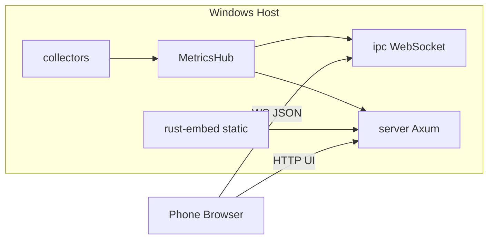

# 总体架构

VivoFlow 采用 **单进程** 部署：Rust 后端负责 Windows 指标采集、JSON IPC，并内嵌托管前端静态资源。手机（如 iPhone XS）通过局域网浏览器访问同一端口。

## 组件关系

## 运行时数据流

1. `main` 创建共享 `AppConfig` 与 `MetricsHub`，并 `spawn_collector` 后台循环。
2. 采集循环按 `interval_ms` 调用 `Collector::collect`，写入 `latest` / `history`，并通过 `broadcast` 推送。
3. 客户端连接 `/ws` 后立刻收到 `config` + 最新 `snapshot`，之后持续接收推送。
4. 客户端可通过 `set_config` 调整间隔、模块开关、历史点数；服务端 `sanitize` 后生效。
5. 生产环境下 UI 来自 `crates/vivoflow/static`（由 `scripts/build.*` 从 `web/dist` 同步）。

## 技术栈摘要

| 层 | 技术 |
|----|------|
| 后端 | Tokio、Axum、sysinfo、WMI、NVML、rust-embed、serde |
| 前端 | Vite、React 19、Tailwind CSS 4、shadcn 风格组件、Motion、Recharts |
| 通信 | WebSocket JSON（主通道）+ 只读 HTTP API（调试） |

## 设计原则

- **缺失即 null**：硬件/驱动无法提供的字段不抛错，序列化为 `null`，UI 显示「不可用」。
- **同域部署**：生产环境前端与 API/WS 同端口，避免跨域。
- **移动优先**：安全区、竖屏单列 / 横屏双列、触控尺寸友好。
